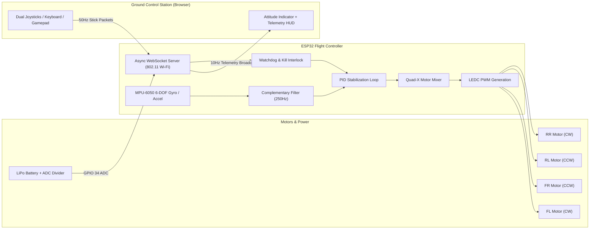

# 🛸 Web-Based Drone Control System

<p align="center">
  
  
  
  
  
</p>

> A high-performance, browser-operated quadcopter flight control system powered by an **ESP32** microcontroller. Features real-time bidirectional WebSocket telemetry, self-hosted soft-AP ground control station (GCS), dual multi-touch virtual joysticks, USB/Bluetooth gamepad support, MPU-6050 attitude stabilization with PID control, and automated fail-safe watchdogs.

Developed by **[Alan Tomar](https://github.com/alantomar)** (Jun 2024).

---

## 🌟 Key Highlights & Features

- **🌐 Zero-Installation Web GCS**: Self-hosted on ESP32 flash memory via `AsyncWebServer`. Connect your phone, tablet, or laptop directly to the drone's Wi-Fi access point (`ESP32-Drone-Control`) and control it directly through any modern web browser at `http://192.168.4.1`.
- **⚡ Low-Latency WebSockets Control**: 50 Hz full-duplex WebSocket communication pipe for ultra-responsive stick inputs (sub-20ms RTT latency).
- **🕹️ Flexible Multi-Input Control Schemes**:
  - **Mode 2 Dual Virtual Joysticks**: Multi-touch support with dynamic spring-loaded return and coordinate deadzones.
  - **USB / Bluetooth Gamepad Support**: Plug-and-play support via the HTML5 Gamepad API (Xbox, PlayStation, or generic controllers).
  - **Keyboard Hotkeys**: `W/S` for Throttle, `A/D` for Yaw, Arrow Keys for Pitch/Roll, and `Spacebar` for Emergency Kill.
- **🧭 Live Aviation Telemetry HUD**:
  - Dynamic **Artificial Horizon (Attitude Indicator)** rendered on HTML5 Canvas.
  - Real-time battery voltage monitoring with low-voltage alert thresholds.
  - Real-time Wi-Fi RSSI signal strength & round-trip ping indicator.
  - 4-channel live motor thrust percentage bars.
- **🛡️ Multi-Tiered Safety & Fail-Safes**:
  - **Watchdog Heartbeat**: Automatically cuts motor throttle to 0% if Wi-Fi signal drops for > 1.0 second.
  - **Extreme Tilt Protection**: Automatic emergency motor cutoff if pitch/roll angle exceeds 45 degrees.
  - **Zero-Throttle Arming Interlock**: Prevents accidental takeoff when toggling from Disarmed to Armed.
  - **Dedicated Emergency Kill Switch**: Instant hardware override to stop motors in any state.
- **🔄 Versatile Motor Drive Support**:
  - Coreless DC motors (716 / 8520) via high-speed 500 Hz N-Channel MOSFET PWM.
  - Standard Electronic Speed Controllers (ESCs) via 50 Hz–400 Hz servo signals.

---

## 📐 System Architecture



---

## 🛠️ Hardware Specifications & Pin Mapping

| ESP32 Pin | Function | Peripheral | Connected Hardware |
|:---|:---|:---|:---|
| **GPIO 25** | Motor 1 (FL - Front Left) | LEDC PWM Ch 0 | N-MOSFET Gate / ESC 1 Signal |
| **GPIO 26** | Motor 2 (FR - Front Right) | LEDC PWM Ch 1 | N-MOSFET Gate / ESC 2 Signal |
| **GPIO 32** | Motor 3 (RL - Rear Left) | LEDC PWM Ch 2 | N-MOSFET Gate / ESC 3 Signal |
| **GPIO 33** | Motor 4 (RR - Rear Right) | LEDC PWM Ch 3 | N-MOSFET Gate / ESC 4 Signal |
| **GPIO 21** | I2C SDA | Hardware I2C 0 | MPU-6050 SDA |
| **GPIO 22** | I2C SCL | Hardware I2C 0 | MPU-6050 SCL |
| **GPIO 34** | Battery Voltage Sense | ADC1 Ch 6 | 100kΩ/100kΩ Voltage Divider |
| **GPIO 2** | Status Indicator | GPIO Output | Onboard Blue LED |

Detailed schematics and component selections are documented in:
- [hardware/SCHEMATICS.md](hardware/SCHEMATICS.md)
- [hardware/BOM.md](hardware/BOM.md)
- [hardware/PINOUT_REFERENCE.md](hardware/PINOUT_REFERENCE.md)

---

## 📁 Repository Structure

```
Web-Based-Drone-Control-System/
├── .gitignore                          # Git configuration
├── LICENSE                             # MIT License
├── README.md                           # Project documentation & overview
├── firmware/
│   └── esp32_drone_controller/
│       ├── esp32_drone_controller.ino  # Main flight controller sketch
│       ├── config.h                    # Pinouts, Wi-Fi credentials, PID constants
│       └── web_assets.h                # In-memory HTML/CSS/JS embedded GCS
├── web_dashboard/                      # Standalone high-fidelity Web GCS
│   ├── index.html                      # Futuristic HUD cockpit interface
│   ├── css/
│   │   └── style.css                   # Glassmorphic aviation styling
│   └── js/
│       ├── app.js                      # WebSocket, state machine & gamepads
│       ├── joystick.js                 # Multi-touch virtual joysticks
│       └── telemetry.js                # Canvas artificial horizon & gauges
├── hardware/
│   ├── SCHEMATICS.md                   # Circuit diagrams & power rail design
│   ├── BOM.md                         # Bill of Materials & component guide
│   └── PINOUT_REFERENCE.md            # ESP32 pin allocation & safety tips
└── docs/
    ├── ARCHITECTURE.md                 # System architecture & JSON protocols
    ├── ARDUINO_IDE_SETUP.md            # Board & library installation guide
    └── CALIBRATION_AND_TESTING.md      # Pre-flight bench testing checklist
```

---

## 🚀 Quick Start Guide

### 1. Flash the Firmware
1. Open [firmware/esp32_drone_controller/esp32_drone_controller.ino](firmware/esp32_drone_controller/esp32_drone_controller.ino) in **Arduino IDE 2.x**.
2. Install the required libraries via Arduino Library Manager:
   - `ESPAsyncWebServer`
   - `AsyncTCP`
   - `ArduinoJson`
   - `Adafruit MPU6050`
   - `Adafruit Unified Sensor`
3. Select your board (`ESP32 Dev Module`) and COM port.
4. Click **Upload**. For complete instructions, see [docs/ARDUINO_IDE_SETUP.md](docs/ARDUINO_IDE_SETUP.md).

### 2. Connect & Fly
1. Power up the drone using a 1S or 2S LiPo battery.
2. From your smartphone, tablet, or laptop, connect to the Wi-Fi network:
   - **SSID**: `ESP32-Drone-Control`
   - **Password**: `drone12345`
3. Open any modern web browser (Chrome, Safari, Edge, Firefox) and navigate to:
   ```
   http://192.168.4.1
   ```
4. Verify sensor telemetry on the **Attitude Indicator**.
5. Ensure the throttle slider is at `0%`, then click **DISARMED** to **ARM** the drone.
6. Gently advance the throttle to take flight!

---

## 📡 WebSocket Communication Protocol

Communication takes place over `ws://192.168.4.1/ws`:

### 1. Stick Control Frame (Client $\rightarrow$ ESP32 @ 50 Hz)
```json
{
  "type": "stick",
  "t": 50,
  "y": 0,
  "p": 12,
  "r": -4,
  "ts": 1718000000
}
```

### 2. Telemetry Frame (ESP32 $\rightarrow$ Client @ 10 Hz)
```json
{
  "type": "telemetry",
  "armed": true,
  "batt": 4.12,
  "rssi": -48,
  "pitch": 3.4,
  "roll": -1.8,
  "yaw": 24.1,
  "m1": 52,
  "m2": 48,
  "m3": 48,
  "m4": 52,
  "echoTime": 1718000000
}
```

---

## ⚖️ License

Distributed under the **MIT License**. See [LICENSE](LICENSE) for details.

---

<p align="center">
  Crafted with passion by <a href="https://github.com/alantomar">Alan Tomar</a> 🛸
</p>
