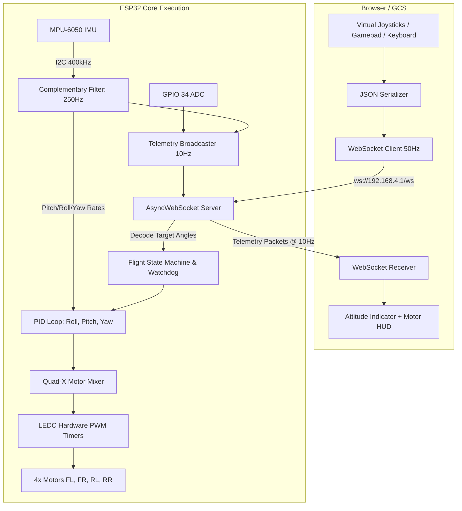
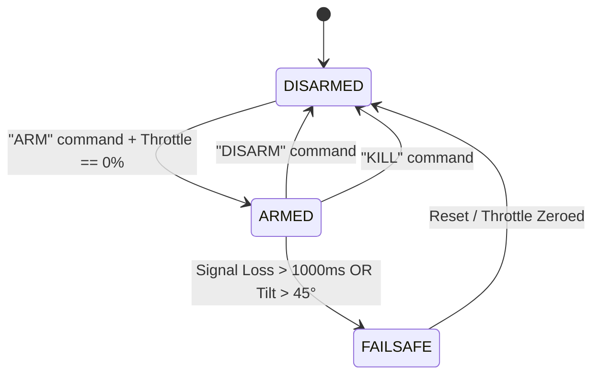

# System Architecture & Communication Protocol

Detailed specification of the software architecture, state machine, and bidirectional WebSocket communication protocol between the Ground Control Station (GCS) and the ESP32 flight controller.

---

## 1. Flight Controller Architecture



---

## 2. Flight State Machine

The ESP32 firmware operates in three distinct states:



1. **DISARMED**:
   - PWM duty cycle = 0.
   - Motors are completely shut off.
   - Joysticks do not affect motor spinning.
2. **ARMED**:
   - Throttle idle spin active.
   - Active PID stabilization maintains pitch, roll, and yaw angles.
3. **FAILSAFE**:
   - Triggered automatically if heartbeat drops for longer than `FAILSAFE_TIMEOUT_MS` (1.0s) or tilt angle exceeds 45 degrees.
   - Throttle immediately cuts to 0% to prevent flyaways.

---

## 3. WebSocket Packet Specification

Communication operates over a persistent WebSocket connection at `ws://<drone_ip>/ws`.

### Client to ESP32: Stick Input (`stick`)
Sent every 20ms (50 Hz):
```json
{
  "type": "stick",
  "t": 45,       // Throttle: 0 to 100%
  "y": 0,        // Yaw Rate: -45 to +45 deg/s
  "p": 10,       // Pitch Angle: -30 to +30 deg
  "r": -5,       // Roll Angle: -30 to +30 deg
  "ts": 17180000 // Millisecond timestamp for RTT latency calculation
}
```

### Client to ESP32: System Command (`command`)
```json
{
  "type": "command",
  "action": "ARM"  // Options: "ARM", "DISARM", "KILL"
}
```

### ESP32 to Client: Telemetry (`telemetry`)
Broadcasted every 100ms (10 Hz):
```json
{
  "type": "telemetry",
  "armed": true,
  "batt": 4.05,       // LiPo voltage in Volts
  "rssi": -42,        // Wi-Fi signal strength in dBm
  "pitch": 2.3,       // Filtered pitch angle in degrees
  "roll": -1.1,       // Filtered roll angle in degrees
  "yaw": 14.5,        // Estimated yaw heading
  "m1": 48,           // FL Motor output percentage
  "m2": 44,           // FR Motor output percentage
  "m3": 44,           // RL Motor output percentage
  "m4": 48,           // RR Motor output percentage
  "echoTime": 1718000 // Returned timestamp for ping calculation
}
```
