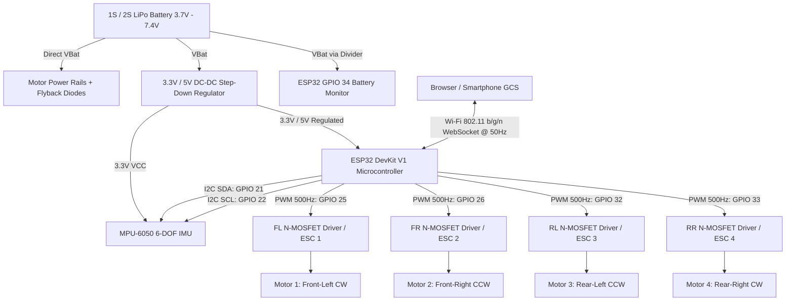

# Hardware Circuit Schematic & Wiring Guide

This document details the circuit architecture, power distribution, and component wiring for the **Web-Based Drone Control System**.

---

## 1. System Block Diagram



---

## 2. Motor Driver Circuit (For Coreless Brushed Motors)

Coreless DC motors (716 / 8520) require an N-Channel logic-level MOSFET (e.g. **SI2302**, **IRLML6344TRPBF**, or **AO3400A**) because the ESP32 GPIOs cannot supply high motor current.

### Single Motor Schematic:
```
+VBat (3.7V - 4.2V LiPo)
   │
   ├───[ + ] Coreless Motor [ - ]────┐
   │                                  │
   └───[<|─ Flyback Diode (1N5819)───┤ (Drain)
                                      │
                         ┌────────────┴───────────┐
                         │   N-Channel MOSFET     │
                         │      (SI2302 / AO3400) │
                         └────────────┬───────────┘
                                      │ (Source)
   ESP32 GPIO (e.g. 25)               │
   ───[ 100Ω Resistor ]─── (Gate)     │
            │                         │
      [ 10kΩ Pull-Down ]              │
            │                         │
   GND ─────┴─────────────────────────┴─────────── GND
```

### Components per Motor Channel:
- **N-MOSFET**: SI2302 or AO3400 (Vds = 20V–30V, Id > 3A, Logic level Vgs(th) < 1.5V)
- **Gate Resistor**: 100 Ω (Dampens ringing and protects ESP32 output driver)
- **Pull-Down Resistor**: 10 kΩ (Ensures motor remains OFF during ESP32 boot/reset)
- **Flyback Diode**: 1N5819 Schottky Diode (Suppresses inductive voltage spikes when PWM switches off)
- **Decoupling Capacitor**: 100 µF 16V Low-ESR electrolytic capacitor across main battery rails

---

## 3. Alternative: Brushless Motor Configuration (ESCs)

If using brushless motors with ESCs (Electronic Speed Controllers):
- Connect **ESC Signal Wire** directly to ESP32 GPIO (25, 26, 32, 33).
- Connect **ESC Ground** to ESP32 Ground (common reference).
- Connect **ESC Power Rails** directly to your 2S/3S LiPo battery.
- Set `#define MOTOR_DRIVE_MODE 2` in `config.h`.

---

## 4. MPU-6050 IMU Sensor Connection

The MPU-6050 communicates via standard I2C bus:

| MPU-6050 Pin | ESP32 Pin | Function |
|:---|:---|:---|
| **VCC** | 3V3 (or 5V if module has onboard 3.3V LDO) | Power Supply |
| **GND** | GND | Common Ground |
| **SDA** | GPIO 21 | I2C Data Line |
| **SCL** | GPIO 22 | I2C Clock Line |
| **AD0** | GND | I2C Address Select (0x68) |
| **INT** | Optional (GPIO 19) | Data Ready Interrupt |

> [!NOTE]
> Most GY-521 breakout boards already feature 4.7 kΩ pull-up resistors on SDA and SCL to 3.3V.

---

## 5. Battery Voltage Divider

To monitor battery level via the ESP32 12-bit ADC (GPIO 34):

```
LiPo (+) ───[ R1: 100 kΩ ]───┬───[ R2: 100 kΩ ]─── GND
                             │
                             └───> ESP32 GPIO 34 (ADC1_CH6)
```

- **Divider Ratio**: $V_{out} = V_{bat} \times \frac{R_2}{R_1 + R_2} = V_{bat} \times 0.5$
- Max 1S Battery voltage = 4.20 V $\rightarrow$ Input to GPIO 34 = 2.10 V (safely below 3.3 V max).
- Add a 100 nF ceramic capacitor between GPIO 34 and GND to filter out motor PWM switching noise.
